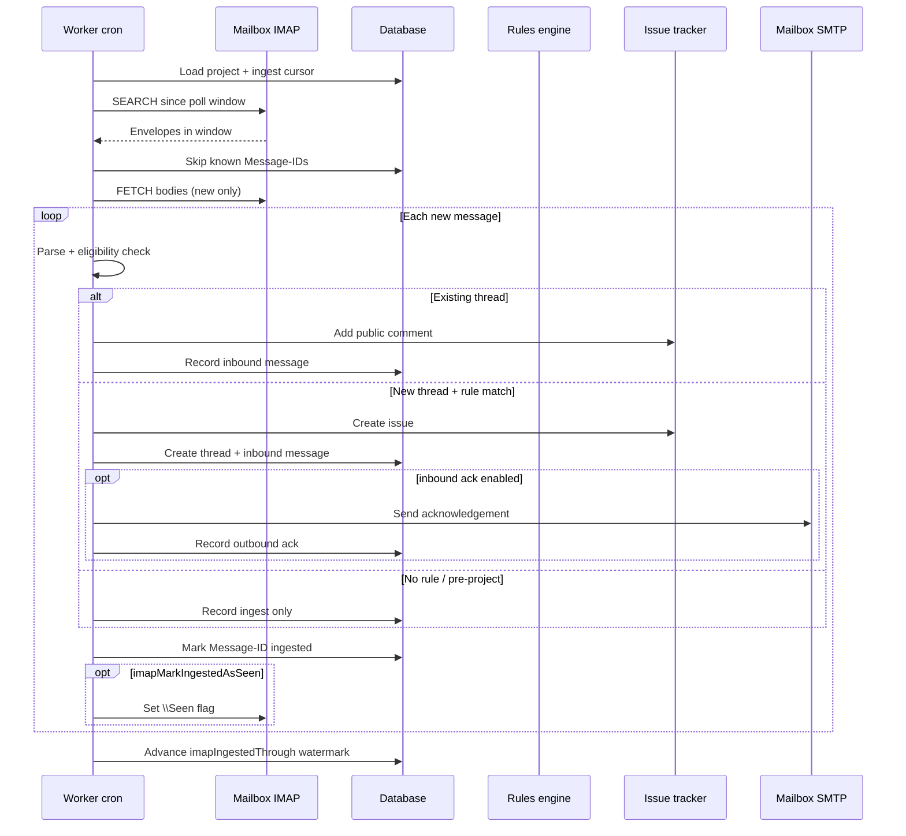
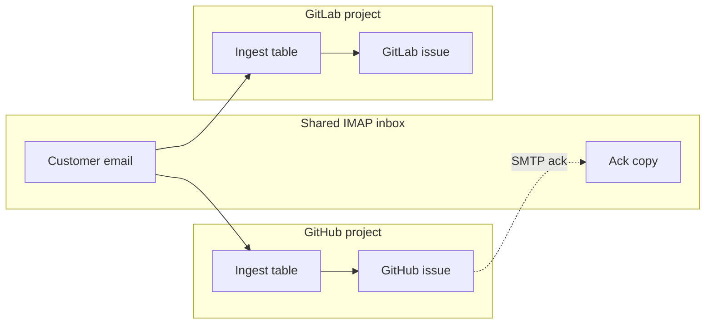
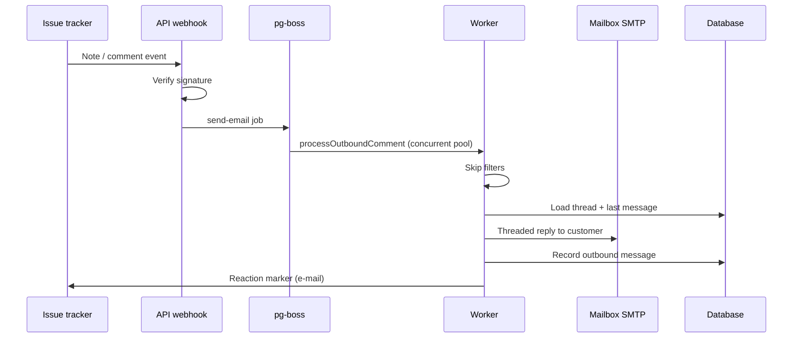

# ServiceBeard sync architecture

ServiceBeard connects a **support mailbox** (IMAP in, SMTP out) to an **issue tracker** (GitLab or GitHub) per project. Sync is bidirectional: customer email becomes issues and comments; public issue comments become threaded email replies.

Projects are **strictly isolated**. Each project has its own mailbox credentials, provider link, rules, threads, and ingest state. Nothing is shared across projects except, optionally, the same physical mailbox credentials configured on multiple projects.

---

## Runtime layout

| Piece                                | Role                                                                           |
| ------------------------------------ | ------------------------------------------------------------------------------ |
| **API** (`apps/api`)                 | HTTP surface: auth, project CRUD, webhook receivers, connection tests          |
| **Worker** (`apps/worker`)           | Background sync: IMAP poll, comment poll, outbound email, webhook registration |
| **Web** (`apps/web`)                 | UI for teams, projects, rules, and conversation history                        |
| **Database**                         | Postgres via Drizzle — projects, threads, messages, rules, ingest cursors      |
| **Providers** (`packages/providers`) | GitLab/GitHub API + webhook parsing                                            |

The worker uses **pg-boss** (Postgres-backed queues) for scheduling and job handoff. The API enqueues outbound work when a webhook arrives; the worker does all heavy lifting.

---

## Scheduling

A cron tick runs **once per minute** (`* * * * *`). Each tick is a **lightweight scheduler** that walks active projects and enqueues per-project jobs only when that project's interval has elapsed. Actual IMAP/comment work runs in separate concurrent worker pools — a slow mailbox no longer blocks other projects.

| Job          | Default interval | Purpose                                         |
| ------------ | ---------------- | ----------------------------------------------- |
| IMAP poll    | 60s              | Inbound email → issue/comment                   |
| Comment poll | 120s             | Outbound fallback when webhooks are unavailable |

### Queues

| Queue                  | Policy    | Role                                                              |
| ---------------------- | --------- | ----------------------------------------------------------------- |
| `imap-poll`            | singleton | Minute cron tick — schedules due projects only                    |
| `imap-poll-project`    | short     | Poll one project's mailbox (`singletonKey = projectId` for dedup) |
| `comment-poll`         | singleton | Minute cron tick — schedules due projects only                    |
| `comment-poll-project` | short     | Poll one project's issue comments (`singletonKey = projectId`)    |
| `send-email`           | standard  | One outbound comment → email send (usually from webhook)          |
| `ensure-webhook`       | standard  | Register/update provider webhook on project create                |

### Concurrency

The worker registers **N independent `boss.work()` handlers** per processing queue (`batchSize: 1` each). Concurrency is env-tunable and identical in docker-compose and Kubernetes:

| Variable                   | Default | Effect                             |
| -------------------------- | ------- | ---------------------------------- |
| `SEND_EMAIL_CONCURRENCY`   | 5       | Parallel outbound email jobs       |
| `IMAP_POLL_CONCURRENCY`    | 3       | Parallel per-project IMAP polls    |
| `COMMENT_POLL_CONCURRENCY` | 3       | Parallel per-project comment polls |

Horizontal scaling still works: multiple worker replicas each run the same pools; pg-boss distributes jobs across replicas. Cron scheduler ticks remain singleton so only one replica enqueues due projects per minute.

### SMTP connection pooling

Outbound project email reuses **pooled nodemailer transporters** keyed by credential fingerprint (`host`, `port`, `secure`, `user`, `password`). Projects sharing identical SMTP credentials share a pool; different credentials on the same host get separate pools. Each pool is capped by `SMTP_MAX_CONNECTIONS` (default 3). Idle pools are evicted after `SMTP_IDLE_TTL_MS` (default 60s).

| Variable               | Default | Effect                                |
| ---------------------- | ------- | ------------------------------------- |
| `SMTP_MAX_CONNECTIONS` | 3       | Max concurrent SMTP connections/pool  |
| `SMTP_MAX_MESSAGES`    | 100     | Max messages per pooled connection    |
| `SMTP_IDLE_TTL_MS`     | 60000   | Close idle transporter pools after ms |
| `SMTP_MAX_POOLS`       | 50      | LRU cap on cached credential pools    |

---

## Provider API rate limiting

All provider HTTP traffic goes through `providerFetch` in `packages/providers`. GitHub, GitLab, and Linear each expose quota headers (and Linear can return `RATELIMITED` in a GraphQL body on HTTP 400). The client parses those signals and groups requests into **credential-scoped buckets**:

| Provider   | Bucket key                                  |
| ---------- | ------------------------------------------- |
| GitHub App | `github:{baseUrl}:install:{installationId}` |
| GitHub PAT | `github:{baseUrl}:token:{hash}`             |
| GitLab     | `gitlab:{baseUrl}:token:{hash}`             |
| Linear     | `linear:token:{hash}`                       |

Multiple projects that share a GitHub App installation or the same API token draw from the **same bucket**. Projects on different installations or tokens are independent.

On a rate-limit response, `providerFetch` throws `ProviderRateLimitError` immediately (no inline sleep). The worker then:

| Path                                             | Behavior                                                               |
| ------------------------------------------------ | ---------------------------------------------------------------------- |
| **IMAP / comment poll scheduler**                | Enqueues per-project jobs; rate limits are handled per job (see below) |
| **`imap-poll-project` / `comment-poll-project`** | Re-enqueue the job with `startAfter` set to the provider's reset time  |
| **`send-email` queue**                           | Re-enqueue the job with `startAfter` set to the provider's reset time  |

Quota snapshots and limit hits are logged via `logProvider` (remaining, reset time, bucket key). Primary provider limits are hourly rolling windows, so waits are typically minutes — deferring per job keeps one rate-limited project from blocking unrelated projects.

---

## Core objects

### Project

One mailbox + one issue tracker repository/group. Holds encrypted credentials, templates, and sync cursors.

### Issue thread

Links a conversation to a single external issue. Stores the original customer sender, normalized subject, and `lastSeenNoteAt` for outbound polling.

Created when the first matching inbound email creates an issue, or when a follow-up is matched to an existing thread.

### Email message

One row per email the project has sent or received, keyed by RFC `Message-ID` per project. Stores direction, threading headers, optional `externalNoteId` (link to provider comment), and address lists.

Used for threading, deduplication of outbound notes, and the UI conversation view.

### Rules

Ordered, per-project matchers (sender / subject / body). First enabled match wins. Default catch-all creates an issue for any unmatched new thread.

---

## Inbound sync (email → issue)



### IMAP fetch strategy

Inbound sync **does not use the IMAP `\Seen` flag** to decide what to process. That flag is optional and write-only (see below).

Instead, each poll:

1. **Compute search window** — `pollSince = max(project.createdAt, imapIngestedThrough − 24h)`. The 24-hour overlap tolerates out-of-order delivery.
2. **IMAP SEARCH** `SINCE pollSince` — bounded scan, not full mailbox history on every poll.
3. **Envelope pass** — fetch headers for all UIDs in the window; skip Message-IDs already in the project's ingest table (loaded for `ingested_at >= pollSince` only).
4. **Body pass** — download full source only for unknown Message-IDs.
5. **Advance watermark** — set `imapIngestedThrough` to the latest IMAP internal date seen in the envelope scan (including already-ingested mail).

On first poll (no watermark), search starts at `project.createdAt`.

### Per-project ingest tracking

Table `project_imap_ingested_messages` records `(project_id, message_id)` for every message this project has **examined**, including:

- successfully synced mail
- skipped mail (no matching rule, pre-project date)
- duplicates

Messages are **not** recorded on processing errors so the next poll retries.

This table is what makes **shared mailboxes** work: two projects can point at the same IMAP login without stealing each other's mail via `\Seen`. Each project maintains its own ingest history.

`email_messages` remains the source of truth for **synced** conversations; the ingest table covers skips and idempotency before sync.

### Optional IMAP mark-as-read

Setting **`imapMarkIngestedAsSeen`** (default on) writes `\Seen` to the mailbox after this project ingests a message. This only affects how the inbox appears in a mail client. It does not gate ServiceBeard sync.

### Eligibility and threading

| Check                                    | Behavior                     |
| ---------------------------------------- | ---------------------------- |
| Email `Date` before project creation     | Skip; record ingest          |
| `Message-ID` already in ingest table     | Skip envelope/body fetch     |
| `Message-ID` already in `email_messages` | Skip processing (safety net) |

**Thread detection** (first match wins, scoped to project):

1. `In-Reply-To` / `References` match a stored `Message-ID` or `in_reply_to` on this project
2. Normalized subject + original sender email match an existing thread

If a thread exists → append a **public** comment. Otherwise → evaluate rules.

### New issue path

When a rule matches with `actionCreateIssue`:

1. Format issue description (template + sync marker embedding `threadId`)
2. Create issue on provider (labels, assignee, status from rule)
3. Insert thread + inbound `email_messages` row
4. Optionally send **inbound acknowledgement** via SMTP (threaded reply to customer; optional CC to support mailbox)

### Content handling

HTML email is converted to markdown for issue bodies. Inline images can be uploaded to the provider. Issue descriptions include a collapsible ServiceBeard footer with a project link and `[internal]` usage hint.

---

## Shared mailbox pattern

Multiple projects may use identical IMAP/SMTP credentials (e.g. one `support@` inbox, separate GitHub and GitLab repos).



Each project polls independently on its own interval. The same physical message may create **separate issues** on each project — that is intentional when routing the same inbox to multiple trackers.

**Control points:**

- Ingest table is per project — no cross-project Message-ID lookups
- IMAP `\Seen` is not used for fetch — one project marking read does not hide mail from another
- Watermark and ingest records are per project — scan cost scales with each project's window, not shared state

---

## Outbound sync (comment → email)



### Triggers

| Path                        | When                                                                       |
| --------------------------- | -------------------------------------------------------------------------- |
| **Webhook** (preferred)     | Provider pushes `note` (GitLab) or `issue_comment` (GitHub) to API         |
| **Comment poll** (fallback) | Worker lists comments since `thread.lastSeenNoteAt` for each active thread |

Webhook handling is fast-path only: API validates, enqueues, returns `200`. Sending happens asynchronously in the worker's concurrent `send-email` pool. Multiple outbound jobs can run in parallel; SMTP connections are pooled per credential set.

### Skip filters

Outbound email is **not** sent when:

| Reason              | Detail                                                                  |
| ------------------- | ----------------------------------------------------------------------- |
| Internal note       | GitLab confidential/internal flag                                       |
| System note         | GitLab system-generated notes                                           |
| `[internal]` marker | Comment starts or ends with `[internal]`                                |
| Sync marker         | Body contains `<!-- servicebeard-sync:… -->` (email-originated content) |
| Bot author          | GitHub `user.type === "Bot"` at webhook parse time                      |
| Already processed   | `externalNoteId` exists in `email_messages`                             |

Skipped notes still advance `lastSeenNoteAt` so polling does not revisit them.

### Reply construction

1. Load thread and **latest** stored message (inbound or outbound)
2. Render outbound template with comment body and author
3. Append quoted previous message (standard `On … wrote:` format)
4. Set `In-Reply-To` / `References` from parent `Message-ID`
5. Send to **original customer email**; optionally CC support mailbox
6. Store outbound row with provider `noteId` for dedup
7. Add provider reaction (📧) on the comment

---

## Loop prevention

Email → issue comment → email loops are broken by layers:

1. **Sync marker** in issue/comment bodies from inbound sync — outbound path ignores these
2. **`[internal]` marker** — agents comment without triggering customer email
3. **Note ID dedup** — same provider comment never sends twice
4. **`lastSeenNoteAt` cursor** — comment poll does not reprocess old notes
5. **Bot filtering** — GitHub bot comments dropped at webhook parse

Inbound acknowledgement and outbound replies are stored as `email_messages` with proper `Message-ID` threading so follow-up customer mail attaches to the correct thread rather than spawning duplicates.

---

## Webhook registration

On project create, `ensure-webhook` registers a project-scoped URL:

```
{WEBHOOK_BASE_URL}/webhooks/{gitlab|github}/{projectId}
```

Requires a **publicly reachable** API URL. If webhooks cannot be registered (e.g. localhost), comment polling still works at the configured interval.

`webhookEnabled` on the project toggles acceptance of incoming events without removing the remote hook.

---

## Error handling

External failures (IMAP, SMTP, provider API) are logged and surfaced as **project sync errors** in the UI (categorized as mail vs provider). A failed inbound message is **not** marked ingested, so the next poll retries. Poll cursors (`lastImapPollAt`, `lastCommentPollAt`) are claimed when a per-project job is enqueued; `imapIngestedThrough` advances only after a successful IMAP poll completes.

Provider rate-limit errors are deferred rather than treated as hard failures — see [Provider API rate limiting](#provider-api-rate-limiting).

---

## Configuration surface (sync-relevant)

| Setting                         | Effect                                                      |
| ------------------------------- | ----------------------------------------------------------- |
| `isActive`                      | Master switch — inactive projects are not polled            |
| `IMAP_POLL_INTERVAL_SECONDS`    | Env var (min 60s, default 60); inbound poll frequency       |
| `COMMENT_POLL_INTERVAL_SECONDS` | Env var (min 60s, default 120); outbound fallback frequency |
| `SEND_EMAIL_CONCURRENCY`        | Parallel outbound email workers (default 5)                 |
| `IMAP_POLL_CONCURRENCY`         | Parallel per-project IMAP poll workers (default 3)          |
| `COMMENT_POLL_CONCURRENCY`      | Parallel per-project comment poll workers (default 3)       |
| `SMTP_MAX_CONNECTIONS`          | Max SMTP connections per credential pool (default 3)        |
| `SMTP_MAX_MESSAGES`             | Max messages per pooled SMTP connection (default 100)       |
| `SMTP_IDLE_TTL_MS`              | Evict idle SMTP pools after ms (default 60000)              |
| `SMTP_MAX_POOLS`                | LRU cap on cached SMTP credential pools (default 50)        |
| `imapMarkIngestedAsSeen`        | Write IMAP `\Seen` after ingest                             |
| `inboundAckEnabled`             | Send auto-reply on new issue                                |
| `inboundAckCcMailbox`           | CC support address on ack                                   |
| `webhookEnabled`                | Accept provider push events                                 |
| Rules                           | Which inbound mail creates issues vs is ignored             |

Templates (`inboundIssueTemplate`, `inboundCommentTemplate`, `outboundCommentTemplate`, `inboundAckTemplate`) control rendered bodies without changing sync control flow.

---

## Mental model

```
Customer email ──IMAP poll──▶ Rules / threading ──▶ Issue tracker
                                                      │
Customer inbox ◀──SMTP send── Public comment ◀── Webhook or poll
```

Each project is a self-contained sync loop: its own mailbox connection, its own ingest cursor, its own issue tracker, its own conversation history. Shared physical mailboxes are supported by per-project ingest state and by not relying on IMAP read flags for fetch logic.

---

## Extensions

Optional extension points let a hosted edition add capabilities (billing, marketing pages, extra routes, DB migrations) without forking the core application. Self-hosted deployments leave the extension manifest unset; behavior is identical to a build without these hooks.

### Extension manifest: `SB_EXTENSION_MANIFEST`

Set `SB_EXTENSION_MANIFEST` to the path of an extension manifest file (typically `extension.config.ts` in the extension repository). The manifest declares:

```ts
export default {
  api: "./path/to/api-extension/index.ts",
  web: "./path/to/web-extension/index.tsx",
  public: "./path/to/static-assets", // optional — merged into web public/cloud/ at build time
  migrations: [
    { dir: "./path/to/drizzle", table: "__drizzle_migrations_extension" },
  ],
};
```

Paths are resolved relative to the manifest file. A loader in `@servicebeard/shared/extensions` reads the manifest at runtime (API, worker, migrations) and at web build time (Vite).

When `SB_EXTENSION_MANIFEST` is unset, nothing is loaded.

### Backend: `register()`

The API loads the manifest's `api` module after mounting core routes (`apps/api/src/extensions.ts`). The worker loads the same module with a worker-specific context (`apps/worker/src/extensions.ts`):

```ts
export async function register(ctx: ExtensionContext): Promise<void>;
export async function register(ctx: WorkerExtensionContext): Promise<void>;
```

A single module may export one `register` function that handles both contexts by checking which properties exist on `ctx`.

### Entitlements

Core API code consults an `EntitlementsProvider` before enforcing team-scoped limits (`apps/api/src/lib/entitlements.ts`):

```ts
interface EntitlementsProvider {
  assertCanCreateProject(teamId: string, currentCount: number): Promise<void>;
  assertTeamAccess(teamId: string, ctx: { path: string }): Promise<void>;
}
```

Default (self-host): both methods are no-ops — unlimited projects, no access gate.

Extensions replace the provider via `setEntitlementsProvider` during `register`. Implementations should throw errors with these messages, mapped to HTTP 402 by the API:

| Error message           | HTTP | `code` field            |
| ----------------------- | ---- | ----------------------- |
| `PROJECT_LIMIT_REACHED` | 402  | `PROJECT_LIMIT_REACHED` |
| `SUBSCRIPTION_REQUIRED` | 402  | `SUBSCRIPTION_REQUIRED` |

Enforcement points:

- **Project creation** — `POST /api/teams/:teamId/projects` calls `assertCanCreateProject` after auth.
- **Team access** — `requireTeamMember` calls `assertTeamAccess` for every team-scoped route. Exempt billing paths in your implementation so teams can subscribe.

### Database migrations

`bun run db:migrate` applies OSS migrations first, then each `migrations` entry from the extension manifest (with its own Drizzle migrations table).

### Frontend: `@extensions`

The web app resolves `@extensions` via Vite/TypeScript path alias (`apps/web/vite.config.ts`). The OSS default is an empty stub (`apps/web/src/extensions/index.tsx`):

```ts
export const extensionRoutes: AnyRoute[] = [];
export const extensionPublicRoutes: AnyRoute[] = [];
export const ExtensionLanding: ComponentType | undefined = undefined;
export function extensionTeamNavItems(teamId: string): ExtensionTeamNavItem[] {
  return [];
}
```

An extended build points the manifest's `web` entry at a module that exports:

- `extensionRoutes` — authenticated TanStack Router routes merged in `apps/web/src/router.ts`
- `extensionPublicRoutes` — public routes (e.g. `/pricing`) mounted without auth
- `ExtensionLanding` — optional landing page shown at `/` for unauthenticated visitors
- `extensionTeamNavItems(teamId)` — extra sidebar links rendered in `Layout.tsx`
- `isExtensionTeamNavActive(pathname, teamId, item)` — optional; OSS provides a default
- `handleApiError(error, context)` — optional 402 → billing redirect handler

Extension UI code can import OSS web components via `@servicebeard/web/*`.

The API client throws `EntitlementRequiredError` (402) when the response includes a `code` field. Extended UIs can catch this and redirect users to billing.

### Self-host checklist

- Do **not** set `SB_EXTENSION_MANIFEST`
- Build the web app with the default `@extensions` stub
- No entitlements provider is registered; limits and access gates are disabled

### Docker and Helm

Build with an optional extension directory:

```bash
docker build --build-context extension=/path/to/extension -f Dockerfile --target api .
```

When the extension manifest declares a `public` directory, the web image build merges those static files into `apps/web/public/cloud/` via `scripts/copy-extension-public.ts` (no extension-specific paths in the Dockerfile). Extensions can also run the same copy locally, e.g. `bun run copy-public` in the extension repo.

Helm values support `extension.enabled`, `extension.manifest`, and `extension.env` for extension-specific configuration.
